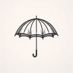
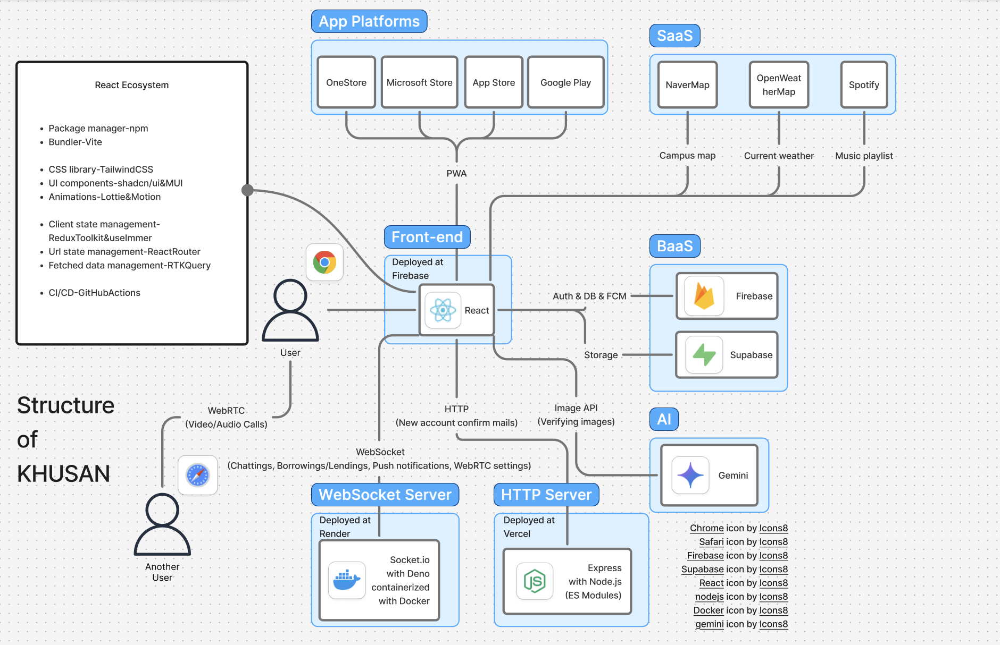

#  KHUSAN(쿠우산) 경희대 캠퍼스 우산 공유 SNS

* 쿠우산 구조

 웹: <https://khusan.co.kr>

 원스토어: <https://m.onestore.co.kr/v2/ko-kr/app/0000776823>

 앱스토어: <https://apps.apple.com/us/app/khusan/id6753282828?l=ko>

 마이크로소프트 스토어: <https://apps.microsoft.com/detail/9n7801hsf6vh?hl=ko-KR&gl=US>

 깃허브: <https://github.com/usany/ports>

 Next.js 기반 문서: <https://begin.khusan.co.kr>

| Icon | Source |
|------|--------|
| <a target="_blank" href="https://icons8.com/icon/3685/globe">Globe</a> | <a target="_blank" href="https://icons8.com">Icons8</a> |
| <a target="_blank" href="https://icons8.com/icon/2586/android-os">Android</a> | <a target="_blank" href="https://icons8.com">Icons8</a> |
| <a target="_blank" href="https://icons8.com/icon/20822/ios-logo">iOS</a> | <a target="_blank" href="https://icons8.com">Icons8</a> |
| <a target="_blank" href="https://icons8.com/icon/ZgfipSZIUMA3/windows-11">Windows</a> | <a target="_blank" href="https://icons8.com">Icons8</a> |
| <a target="_blank" href="https://icons8.com/icon/62856/github">GitHub</a> | <a target="_blank" href="https://icons8.com">Icons8</a> |
| <a target="_blank" href="https://icons8.com/icon/59777/document">Document</a> | <a target="_blank" href="https://icons8.com">Icons8</a> |