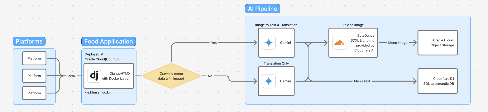

# KHUSAN(쿠우산) 경희대 캠퍼스 우산 공유 SNS

 웹: https://khusan.co.kr

 원스토어: https://m.onestore.co.kr/v2/ko-kr/app/0000776823

 앱스토어: https://apps.apple.com/us/app/khusan/id6753282828?l=ko

 마이크로소프트 스토어: https://apps.microsoft.com/detail/9n7801hsf6vh?hl=ko-KR&gl=US

 깃허브: https://github.com/usany/ports

 Next.js 기반 서: https://begin.khusan.co.kr

<a target="_blank" href="https://icons8.com/icon/3685/globe">Globe</a> icon by <a target="_blank" href="https://icons8.com">Icons8</a>

<a target="_blank" href="https://icons8.com/icon/2586/android-os">Android</a> icon by <a target="_blank" href="https://icons8.com">Icons8</a>

<a target="_blank" href="https://icons8.com/icon/20822/ios-logo">iOS</a> icon by <a target="_blank" href="https://icons8.com">Icons8</a>

<a target="_blank" href="https://icons8.com/icon/ZgfipSZIUMA3/windows-11">Windows</a> icon by <a target="_blank" href="https://icons8.com">Icons8</a>

<a target="_blank" href="https://icons8.com/icon/62856/github">GitHub</a> icon by <a target="_blank" href="https://icons8.com">Icons8</a>

<a target="_blank" href="https://icons8.com/icon/59777/document">Document</a> icon by <a target="_blank" href="https://icons8.com">Icons8</a>

# KHUBUS(쿠우버스) 경희대 캠퍼스 버스 알림

# KHUKIE(쿠우키) 경희대 캠퍼스 식단 알림

This is an [Expo](https://expo.dev) project created with [`create-expo-app`](https://www.npmjs.com/package/create-expo-app).

## Get started

* visit page and download images
* from images to texts
* post images and texts to db
* generate images based on texts
